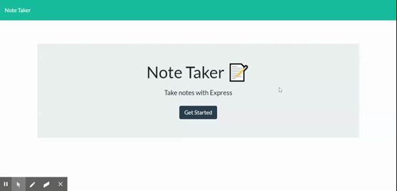

# Note Taker

## Description

This project was created by modifying starter code to create the back-end of a note taking application. Elements of this project include:
* Node.js
* ExpressJS
* deployed through Heroku

## Deployed URL

[Click here for the deployed URL](https://glacial-bastion-29913.herokuapp.com/)

## Installation

To install this application run ``npm install`` in your CLI to install all dependencies, then ``node server.js`` to open the application locally. This app uses ``http://localhost:3000`` local server.

## Usage 

The gif below demonstrates the functionality of the app:

## License

> This project was created under the [MIT License](https://opensource.org/licenses/MIT)

